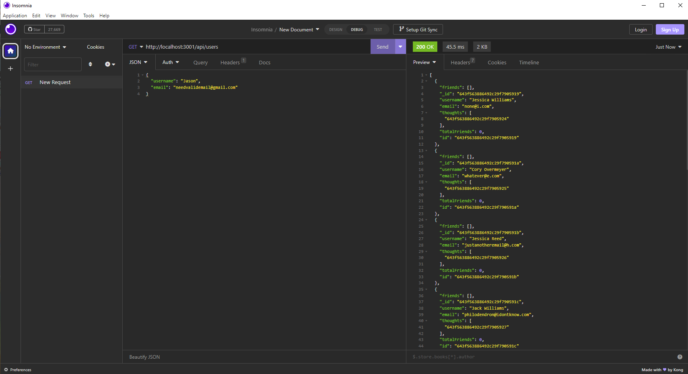

# socialNetworkAPINoSQL

## Description
A backend app for a social media site.  Allows you to create, update, read, and delete users and their thoughts.  Allows for friends to be added, and reactions to be posted to thoughts.

## Table of Contents
* [Installation](#installation)
* [Usage](#usage)
* [License](#license)
* [Contributing](#contributing)
* [Tests](#tests)
* [Questions](#questions)

## Installation
NPM packages will need installed.  Some sort of tool like Insomnia (used in the demo video) will be needed to see the server information

## Usage
This app can be connected with a front end for many beginning needs a social media site has.  Unique IDs are attributed to users, their thoughts, and their reactions, so it can all be deleted and edited as needed

[Walkthrough Video](https://drive.google.com/file/d/1pYkJYzkFqwcljLegJAVPL_Vbg3ckYYDd/view)

## License

MIT License

A short and simple permissive license with conditions only requiring preservation of copyright and license notices. 
Licensed works, modifications, and larger works may be distributed under different terms and without source code.

[License Source](https://choosealicense.com/licenses/)
    

## Contributing
No further contributions needed at this time.  If you'd like to email me with suggestions, my address is below.

## Test
No testing needed.  If you follow the demo video you can test that you've set it all up correctly in your local environment.

## Questions
If you have any questions, please email me at quickfire25@yahoo.com.
You can also find more information at https://github.com/SotoTheMayor
